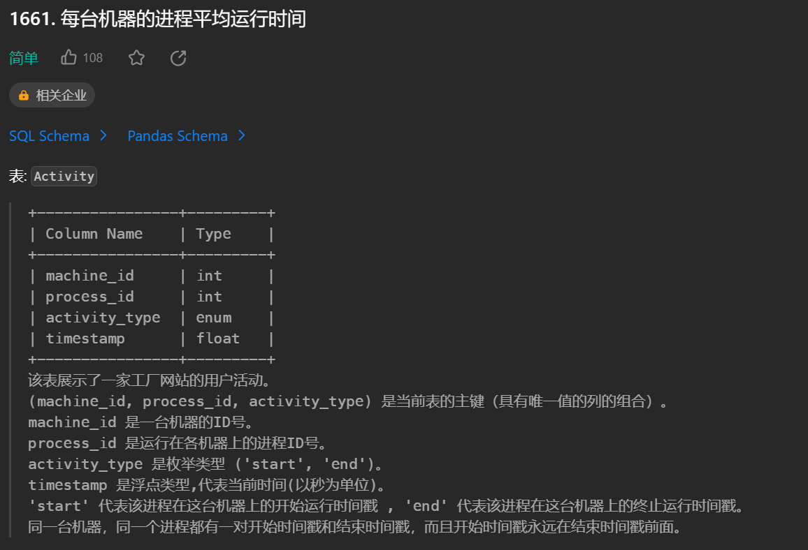
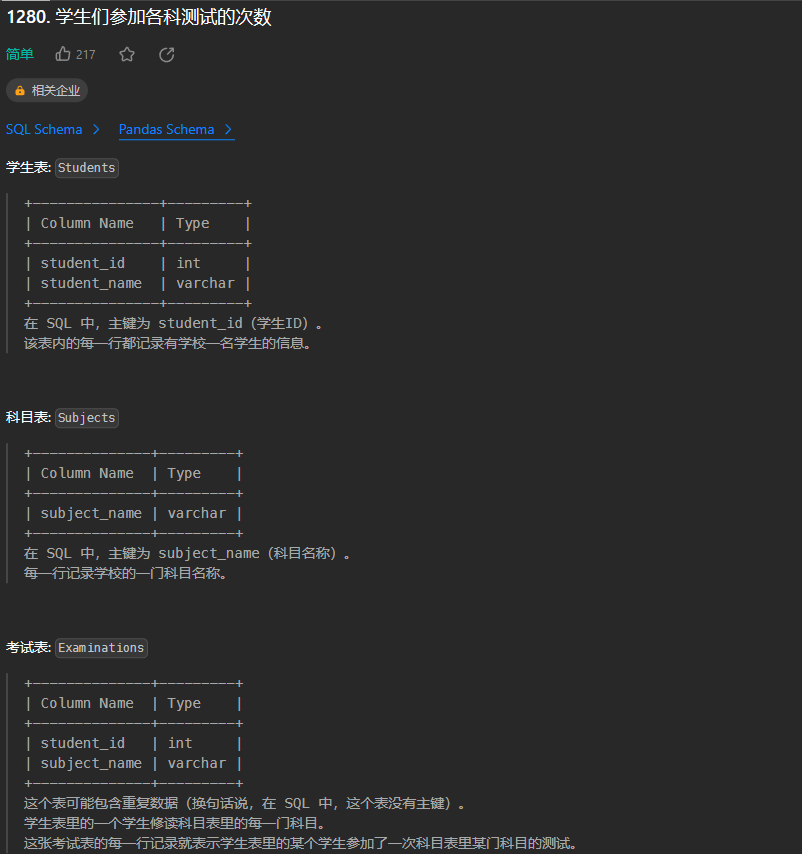
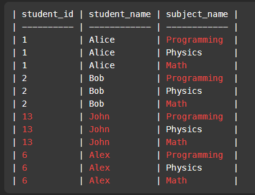
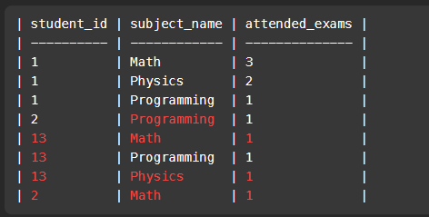
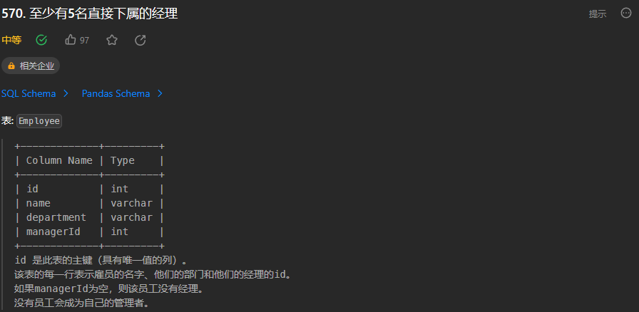

### 1661 每台机器的进程平均运行时间



```mysql
SELECT p.machine_id, ROUND(AVG(q.timestamp - p.timestamp), 3) processing_time
FROM
	Activity p
	INNER JOIN Activity q ON p.machine_id = q.machine_id 
	AND p.process_id = q.process_id 
	AND p.activity_type = 'start' 
	AND q.activity_type = 'end'
	GROUP BY p.machine_id;
```

1. 先连接两个表
2. 分组求平均值
3. 取3位小数


### 1280 学生们参加各科测试的次数



三表联查，用到了

1. **笛卡尔积：CROSS JOIN**
2. IFNULL()函数

过程：

1. `SELECT * FROM Students AS stu CROSS JOIN Subjects AS sub `形成表1

   

2. `SELECT student_id, subject_name, COUNT(*) AS attended_exams FROM Examinations GROUP BY student_id, subject_name`形成表2

   

3. 之后将两表联立即可

```MySQL
SELECT 
stu.student_id, stu.student_name, sub.subject_name, IFNULL(g.attended_exams, 0) AS attended_exams 
FROM 
Students AS stu 
CROSS JOIN Subjects AS sub 
LEFT JOIN 
(SELECT student_id, subject_name, COUNT(*) AS attended_exams 
 FROM Examinations GROUP BY student_id, subject_name) 
 AS g 
 ON stu.student_id = g.student_id AND sub.subject_name = g.subject_name ORDER BY stu.student_id, sub.subject_name;
```


### 570 至少有5名直接下属的经理



用到了**自连接**

join

自连接（Self-Join）是指在一个表内进行连接操作，连接表的同一列与该表的其他行的列。这种情况通常在一个表中包含了对自身的引用或关系时出现。

在自连接中，你给表取别名（alias），然后使用这些别名来指代同一表的不同实例。这样可以创建一个逻辑上的连接，就像你连接两个不同的表一样。

```MYSQL
select Name
from (
  select Manager.Name as Name, count(Report.Id) as cnt
  from
  Employee as Manager join Employee as Report
  on Manager.Id = Report.ManagerId
  group by Manager.Id
) as ReportCount
where cnt >= 5

```

