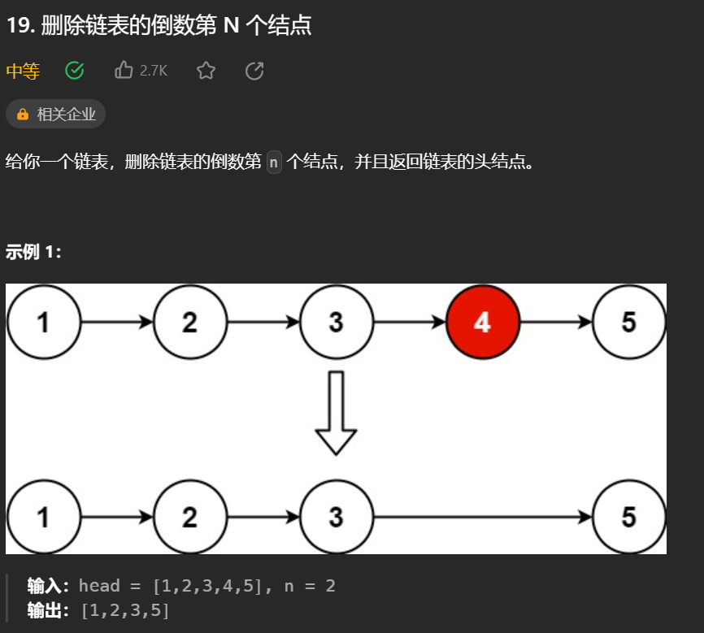
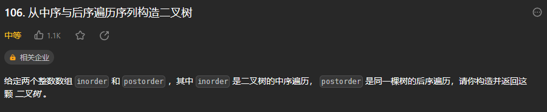
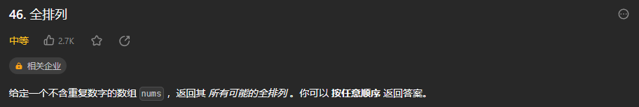

# 数据结构

## 数组


## 链表

### 707 设计链表

**重点：**


### 206 反转链表


**重点：**需要有两个指针。pre指向上一个顶点，curr指向当前顶点。

在循环中，如果直接令curr.next = pre，会导致丢失下一个顶点。所以要提前用一个中间指针temp = curr来保存当前顶点，并且使curr = curr.next指向下一个顶点。


**两种解法：**常规法和递归


### 24 两两交换链表节点


**重点：**需要dummy head，分三步走


**两种解法：**常规法和递归

### 19 删除链表中倒数N个节点

**重点：** 双指针法


###　160 链表相交


**重点：**找到两个链表中的不变量：末尾段的长度


### 142 环形链表Ⅱ

<font color = "red">经典题</font>


**这道题需要具有数学思维**


**方法一：**使用数据结构

用ArrayList或HashSet将每个遍历过的节点都保存下来

如果用ArrayList，底层是遍历查找，搜索效率比较低，效率为O(N)

而HashSet，底层是hashtable，用哈希映射查找，效率为O(1)

**方法二：**使用双指针法+数学推导


## 哈希表

### 242 有效的字母异位词

**方法一：**用一个数组简单实现：只能存对应26个字母

**方法二：**能存任意字符


### 349 两个数组的交集


常规方法，二重循环，时间复杂度为O(n^2)

用HashSet解决


### 202 快乐数


**重点：**如果是无限循环变不到1的话，平方和会重复出现。因此只需要一个hashset用来存储平方和，判断有无重复出现即可。

### 1 两数之和


<font color="red">梦开始的地方</font>

**重点：**用哈希表

### 454 四数相加Ⅱ


时间复杂度O(n^2)

对于1、2用两重循环，把每一对i+j存储到哈希表中，值为i+j出现的次数

对于3、4也用两重循环，判断哈希表中是否有-(i+j)

### 383 赎金信


**方法1：**用hashmap

**方法2：**用数组，较为节省空间

### 15 三数之和      <font color="red">不会</font>


注意使用**双指针法**，以及该如何去重


### 18 四数之和


由该题可以引申推广到n数之和

重点在于：剪枝和去重


## 字符串

### 344 反转字符串

简单

### 541反转字符串Ⅱ

简单

### LCR 122. 路径加密 剑指Offer 05.替换空格


**方法一：**简单新建一个字符串

**方法二：**双指针法

双指针法必须从后往前，因为只有从后往前移动的时候，才为O(n)，从前往后为O(n^2)

<font color="red">**其实很多数组填充类的问题，都可以先预先给数组扩容带填充后的大小，然后在从后向前进行操作**</font>

(其实上述方法只适用于c++，因为Java不能数组扩容)

### 151 反转字符串中的单词


**方法1：**新建一个char[]或list，用双指针，倒序遍历原数组，把单词一个一个添加到char[]或list中

用char[]可能更节省时间和内存

**方法2：**先删除多余空格，然后颠倒整个数组，然后针对每个单词再颠倒

这里涉及到对字符串String进行很多操作。如果直接对String进行操作的话可能会导致新建太多String，速度慢且消耗内存大。应该使用StringBuilder

### LCR 182 动态口令 剑指Offer58-II.左旋转字符串


**方法一：**新建char[]，把前target个字符放到后面

**方法二：**还是进行颠倒


### 28 找出字符串中第一个匹配项的下标


**KMP算法**

生成next数组步骤：

1. 初始化next数组
2. 处理前后缀不相同情况
3. 处理前后缀相同情况
4. 更新next数组

利用next数组进行匹配步骤：

1. 判断模式串是否为空
2. 进入循环

### 459 重复的子字符串


**方法一：**暴力法

外层循环j表示子串长度，从1到s.length()/2

内层循环i用于遍历字符串，注意true条件，要同时满足i%j到了子串最后一个，且i同时到了字符串最后一个

**方法二：**移动匹配


既然前面有相同的子串，后面有相同的子串，用 s + s，这样组成的字符串中，后面的子串做前串，前面的子串做后串，就一定还能组成一个s，如图

所以判断字符串s是否由重复子串组成，只要两个s拼接在一起，里面还出现一个s的话，就说明是由重复子串组成。

当然，我们在判断 s + s 拼接的字符串里是否出现一个s的的时候，**要刨除 s + s 的首字符和尾字符**，这样避免在s+s中搜索出原来的s，我们要搜索的是中间拼接出来的s。

但最终要是要判断一个长字符串中有没有那个短字符串，可能会用到KMP

**方法三：KMP**

**在由重复子串组成的字符串中，最长相等前后缀不包含的子串就是最小重复子串，这里拿字符串s：abababab 来举例，ab就是最小重复单位，如图所示：**


数组长度为：len。

如果len % (len - (next[len - 1] + 1)) == 0 ，则说明数组的长度正好可以被 (数组长度-最长相等前后缀的长度) 整除 ，说明该字符串有重复的子字符串。

**数组长度减去最长相同前后缀的长度相当于是第一个周期的长度，也就是一个周期的长度，如果这个周期可以被整除，就说明整个数组就是这个周期的循环。**


## 双指针

### 27 移除元素（同数组）


### 344 反转字符串（同字符串）


### LCR 122. 路径加密 剑指Offer 05.替换空格（同字符串）


### 151 翻转字符串里的单词（同字符串）


### 206 反转链表（同链表）


### 19 删除链表的倒数第N个节点（同链表） 



### 160 链表相交（同链表）


### 142 环形链表Ⅱ（同链表）


### 15 三数之和（同哈希表）


### 18 四树之和（同哈希表）


## 栈和队列

### 232 用栈实现队列


要使用两个栈，一个出栈一个进栈

### 225 用队列实现栈


**方法一 使用两个队列：**

1. 在每次pop的时候，把mainqueue的元素除了末尾的一位，全放到subqueue中。之后弹出mainqueue中的元素，然后把subqueue中的所有元素全放回mainqueue中。
2. 在每次push的时候，把mainqueue的元素，全放到subqueue中。之后放入元素到空的mainqueue中，然后再把subqueue的所有元素都放到mainqueue中。

<font color="red">尽量在push上做文章，这样后续pop和peek的时候不需要做改动。这点与232不同</font>

**方法二 使用一个队列：**

1. 一个队列在模拟栈弹出元素的时候只要将队列头部的元素（除了最后一个元素外） 重新添加到队列尾部，此时再去弹出元素就是栈的顺序了

### 20 有效的括号

<font color="red">用栈解决的经典问题</font>


### 1047 删除字符串中的所有相邻重复项


**用ArrayDeque实现栈，效率比Stack高**：

在Java Doc里建议使用Deque接口替代Stack完成栈的功能，为什么呢？
因为Stack是继承Vector，Vector是由数组实现线程安全（方法使用synchronized修饰）的集合类，它包含了大量集合处理的方法，而Stack复用了Vector的方法实现进栈和出栈的操作，基于数组实现相比于链表实现，效率上受影响。同时，因为继承Vector类，Stack可以复用Vector的方法，这是Stack设计不严谨的地方
————————————————

原文链接：https://blog.csdn.net/weixin_40096160/article/details/120772876

### 150 逆波兰表达式求值


其实就是后缀表达式而已

### 239 滑动窗口最大值   *单调队列*


<font color="red">除了队首元素是从前面移除外，其它元素是从后面移除。</font>

**关键：**设计一个类，其有三种方法

```java
class que() {
    public int pop(int val){};
    public void push(int val){};
    public int getMax(){};
}
```


对于2 5 3 4 1


**pop()**时，判断要pop的元素是否和front元素一样。如果一样则popfront，不一样则不，因为在push时就把比font元素小的元素删掉了

**push()**时，判断front元素右侧的元素是否比新来的back元素小，小的话先全部popback再push

### 347 前K个高频元素   *优先级队列*


**方法1：**可以用一个map，放入<元素，次数>组成的键值对，然后按照次数进行排序。快速排序时间复杂度O(nlogn)。

但是实际上，我们不一定要维护整个map，我们可以只维护map中的前K个元素

**方法2：**使用**优先级队列 PriorityQueue**，其实是**一个披着队列外衣的堆**，优先级队列对外接口只是从队头取元素，从队尾添加元素，再无其他取元素的方式，看起来就是一个队列。

分为**大顶堆：**最上方的为最大值 和**小顶堆：**最上方的为最小值

```java
从队头到队尾按从小到大排就是最小堆（小顶堆），从队头到队尾按从大到小排就是最大堆（大顶堆）
```

资料见：[Java 优先队列（PriorityQueue）总结_java priorityqueue-CSDN博客](https://blog.csdn.net/qq_36511997/article/details/121244158)


**要注意：**若想生成小顶堆，从队首到队尾从小到大排

```Java
PriorityQueue<int[]> pq = new PriorityQueue<>((o1, o2) -> o1[1] - o2[1]);
```

这里要o1-o2，这与以往用Comparator生成从小到大序列时所用的o2-o1不同。或许是因为在小顶堆中，次序为 `队尾 3 2 1 0 -1 队首`

## 二叉树

### 二叉树的递归遍历

**递归三要素：**

1. **确定递归函数的参数和返回值：** 确定哪些参数是递归的过程中需要处理的，那么就在递归函数里加上这个参数， 并且还要明确每次递归的返回值是什么进而确定递归函数的返回类型。
2. **确定终止条件：** 写完了递归算法, 运行的时候，经常会遇到栈溢出的错误，就是没写终止条件或者终止条件写的不对，操作系统也是用一个栈的结构来保存每一层递归的信息，如果递归没有终止，操作系统的内存栈必然就会溢出。
3. **确定单层递归的逻辑：** 确定每一层递归需要处理的信息。在这里也就会重复调用自己来实现递归的过程。

前序、中序、后序三种方式类似。

### 二叉树的迭代遍历 不会

**递归的实现就是：每一次递归调用都会把函数的局部变量、参数值和返回地址等压入调用栈中**，然后递归返回的时候，从栈顶弹出上一次递归的各项参数，所以这就是递归为什么可以返回上一层位置的原因。

此时大家应该知道我们**用栈也可以**实现二叉树的前后中序遍历

在迭代的过程中，有两个操作：

1. **处理：将元素放进result数组中**
2. **访问：遍历节点**

- **前序：**入栈顺序 中 弹出 右 左

  这样子弹出时才是中左右的顺序

- **中序：**中序与前序、后序不同。其访问顺序和处理顺序不一致，导致和前序写法不同。因此需要借助一个**指针**，来帮助访问节点。

  

  思路：一个栈stack，一个指针curr。

  因为要先处理左边的，所以能往左走就往左走。（而在前序中要先处理中，因此不会先往左走，如果往左走了就不是先处理中了。）

  ①**curr不断往左边走。**如果指针curr当前访问的元素不为空，就把当前元素加入到stack中。此时把最左边的一串都加入了stack中。

  ②**当curr往左走到尽头，即curr为空是**，从stack中弹出，赋值给curr，并存到数组中。之后往curr的右边走。

- **后序**：再来看后序遍历，先序遍历是中左右，后续遍历是左右中，那么我们只需要调整一下先序遍历的代码顺序，就变成中右左的遍历顺序，然后在反转result数组，输出的结果顺序就是左右中了

  

```java
后序遍历顺序 左-右-中 入栈顺序：中-左-右 出栈顺序：中-右-左， 最后翻转结果
```


### 二叉树的层序遍历

####  102 二叉树的层序遍历


**方法一：** **BFS，用队列实现。**两层循环，外层用于遍历层，内层用于遍历层里的每个点。每pop一个元素，就把其左右子叶放到队列中

**方法二：** **DFS，用递归实现**

#### 107 二叉树的层序遍历Ⅱ


遍历后反转

#### 199 二叉树的右视图


层序遍历后找到最右边的即可

#### 637 二叉树的层平均值


#### 429 N叉树的层序遍历


只是把left、right换成children而已

#### 515 在每个树行中找最大值


注意每层循环时 max的初始赋值

#### 116 填充每个节点的下一个右侧节点指针


#### 117 填充每个节点的下一个右侧节点指针Ⅱ


和上一题没区别

#### 104 二叉树的最大深度


#### 111 二叉树的最小深度


不用想太多。找到第一个叶子节点的时候直接返回即可。


### 226 反转二叉树


**方法一：递归法**

1. 先确定要要使用哪种遍历，前后均可，但中序不行，因为先左孩子交换孩子，再根交换孩子（做完后，右孩子已经变成了原来的左孩子），再右孩子交换孩子（此时其实是对原来的左孩子做交换）

**方法二：迭代法**

1. 同样要先想好用哪种方式进行遍历

### 101 对称二叉树 放入null


**方法一：递归法**

- 分为外层的比较和内层的比较。终止条件有四种，函数体里分为判断外侧和判断内侧。函数体里有两重递归，一个用来判断外侧是否相同，一个用来判断内侧是否相同。最后只有内侧外侧均为true的时候才会返回true

  

**方法二：迭代法**

- 每当比完两个顶点自己后，就把其外侧子节点和内侧子节点放到队列中。有点层序遍历的思想，但不完全是。关键在于**成对放入，成对取出**。因为只是要成对比较，所以用队列或栈或数组都可以。仅仅通过一个容器来成对的存放我们要比较的元素。

- **注意：**有些集合可以放入null，但有些不行。具体见

  [Java中集合能否加入null值_list添加null_鼠鼠我呀2的博客-CSDN博客](https://blog.csdn.net/weixin_44484668/article/details/124996035)

### 104 二叉树的最大深度


这道题之前做过，但也可以用别的方法再写一遍。

**方法一：层序遍历**  最简单

**方法二：递归**  递归的核心在于 要想明白返回值是什么。

- **后序：**因为后续最后才判断当前节点的深度，因此这里的返回值应该是当前这个节点的深度。而判断当前节点的深度，其为左节点和右节点的最大深度+1。这个也是函数体的内容。
- **前序：**前序时，要先判断当前节点的深度。需要一个成员变量来记录最大值。
- **前序和后序最大区别在于：**前序是求深度，从上往下走。后序是求高度，从下往上走

### 599 N叉树的最大深度


类似104

**迭代法**

**递归法**

### 111 二叉树的最小深度


**迭代法**

**递归法** 这个递归法有点不一样。后序时，不能简单的用min(左，右)来判断当前节点的深度。要分为：①左空②右空③左右空

感觉递归性能远不如迭代

在前序时，总会遇到：min不知道初始值设为多少的问题。如果设为0，那么每次`Math.min(min, depth)`时，都会返回0。我这里简单解决了，之后再找别的方法。

### 222 完全二叉树的节点个数


可以使用常规的**迭代法**、**递归法**

这道题可以针对完全二叉树进行改进


因为是完全二叉树，从根节点分别一直向左和右递归时，如果得到的左和右的深度相同，说明为满二叉树

### 110 平衡二叉树 没做迭代


注意区分高度和深度

### 257 二叉树的所有路径


因为我们要首先按顺序把中节点的val记录下来，所以要用前序。

**递归法：**只能前序。不同于往常的递归结束判断。此外要注意**回溯**，并且要把**递归和回溯放到一起**。

**迭代法：**这里迭代法的**回溯很不一样！**


### 404 左叶子之和


**迭代法**

**递归法**

本题要用父节点来进行判断

### 513 找树左下的值 ！！回溯的关键！！


**迭代法** 层序遍历即可实现

**递归法** 这里回溯很重要！


要注意！这里depth++，自增后的depth指的是下一层的depth，而不是这一层的！所以每次返回后都得减去1。这个回溯也可以隐藏起来，比如写到递归函数中depth+1

我这里的递归和随想录的递归写法有些不同，我在这里没有判断node的左右是否为空。因为我这里实际上，我是把每个深度下最左边的的节点都放进去了，之后如果有更深的就做替换。随想录是判断其没有左右子叶才放，其实差不多。

**注意：**若traversal(node, depth+1), 则是把回溯隐藏在了函数中。函数外的depth未改变，不需要对其特意处理

### 112 路径总和 回溯返回值问题


可递归，迭代。无需对中进行处理，因此前中后均可

**递归，什么时候需要返回值，什么时候不需要？**

- 如果需要搜索整棵二叉树且不用处理递归返回值，递归函数就不要返回值。（这种情况就是本文下半部分介绍的113.路径总和ii）
- 如果需要搜索整棵二叉树且需要处理递归返回值，递归函数就需要返回值。 （这种情况我们在[236. 二叉树的最近公共祖先 (opens new window)](https://programmercarl.com/0236.二叉树的最近公共祖先.html)中介绍）
- 如果要搜索其中一条符合条件的路径，那么递归一定需要返回值，因为遇到符合条件的路径了就要及时返回。（本题的情况）

### 112 路径总和Ⅱ


同样 可递归可迭代。迭代有点麻烦要写三个栈，懒得写了

### 106 从中序与后序遍历序列构造二叉树 难



**中序：左中右**

**后序：左右中**

**步骤：**

1. 判断后续数组是否为空，为空返回

2. 后序数组最后一个元素为节点元素

3. 在中序数组中寻找位置作为切割点

4. 切中序数组，此时切分为左中序和右中序。即，左中序数组中都是当前节点的左子树节点，右中序数组中都是当前节点的右子树节点。

5. 此时用左中序号数组，来切后序数组，将其分成左后序和右后序

6. 递归处理。左中序当新的中序，左后序当新的后序；

   ​                   右中序当新的中序，右后序当新的后序；

返回值设为Treenode，因为每一层递归都是针对当前node来确定其左右子树，最后把确定好左右子树的node返回，然后将其挂在上一层递归节点的左子节点或右子节点。

此外，还要注意的一点是，要注意是数组是左闭右开还是左闭右闭

### 105 从中序与后序遍历序列构造二叉树


### 654 最大二叉树


思路和前两者相似，但更为简单

**构造树一般采用的是前序遍历，因为先构造中间节点，然后递归构造左子树和右子树** 

### 617 合并二叉树


可以分为不新建树和新建树两种。迭代法如果不新建树会很复杂。

### 700 二叉搜索树中的搜索


**递归**

**迭代**

使用迭代法要注意利用BST中**有序**的特点

不需要栈来模拟深度遍历或者队列来模拟广度遍历

### 98 验证二叉搜索树 没做出来


要知道中序遍历下，输出的二叉搜索树节点的数值是**有序序列**。

有了这个特性，**验证二叉搜索树，就相当于变成了判断一个序列是不是递增的了。**

**关键在于：**将二叉树按中序遍历后其转换为一个序列！

可以用迭代法和递归法判断。有两种方案

1. 遍历后生成一个新数组，再挨个比较
2. 在遍历时就进行比较。但这种情况要考虑比较值的初始生成问题。

### 530 二叉搜索树的最小绝对差 比较对象的初始值设置问题


注意利用**二叉搜索树的特性！**

同样要考虑要比较大小时，作为比较对象的**result初始值**要怎么设置？

### 501 二叉搜索树中的众数


如果不使用BST性质，就是先遍历一遍生成一个map，然后将map排序。

使用BST性质

### 236 二叉树的最近公共祖先


实现了两种方法

**方法一：**使用递归，利用前序，找到p和q节点的路径并保存，之后找路径中离他们最近的公共元素。

**方法二：**使用递归，利用后序，从下往上找。当找到p或q时，直接不断返回p或q相应节点，没找到时返回null。在中序判断时，如果左节点找到p且右节点找到q，返回当前节点，否则返回找到的一个节点或null。具体看代码。

### 235 二叉搜索树的最近公共祖先


递归。BST自带方向性，不用考虑前中后和回溯。直接按特性遍历即可

### 701 二叉搜索树中的插入操作


不要把问题复杂化，不需要重构二叉树

只要按照二叉搜索树的规则去遍历，找到空节点之后存放就可以，一定能找到底端合适的位置

### 450 删除二叉搜索树中的节点 分多种情况


涉及到树结构的调整，比插入复杂很多！

分为五种情况

1. 没搜索到 node == null

2. node左右都为空

3. node左空右不空

4. node右空左不空

5. node左右都不空

   此时需要把node左子节点挂到node右树最左边节点的左子节点上。

### 669 修剪二叉搜索树 不会


注意思想，多看两遍


当走到了0，即不在区间内时，判断接下来要从左子树还是右子树找下一个满足条件的点。

### 108 将有序数组转换为二叉搜索树


简单。平衡搜索二叉树，关键在于**找切点**

从有序数组的中间切即可。

递归很简单，迭代要思考

迭代有点像层序遍历。脑子糊，不想了。

### 538 把二叉搜索树转换为累加树


这道题实际是右中左的顺序，反中序。

从最右边开始累加，依次给中赋值。

# 算法

## 回溯

### 77 组合问题


第一次遇到真正的回溯问题

**所有的回溯问题都可以转化为树型结构**


可以进行剪枝优化

### 216 组合优化Ⅲ


### 17 电话号码的字母组合


要搞清楚如何实现数字到字母的映射

### 39 组合总和


注意每次for循环时，i的起始值即可

**总结：**

对于数组[1, 2, 3, 4]

不可重复时：若取1，下一次从2，3，4中取；若取2，下一次从3，4中取

可重复时：若取1，下一次从1，2，3，4中取；若取2，下一次从2，3，4中取

### 40 组合总和Ⅱ 有些难


本题candidates 中的每个数字在每个组合中只能使用一次。

**分析：**使用过，具有两个个层面的含义

同一树层上使用过 和 同一树枝上使用过

这里要排除掉的是，同一数层上使用过

可以使用一个used数组，或者用索引来判断是否需要跳过。


### 131 分割回文串


回溯

### 91 复原IP地址


**步骤：**

这道题深度控制为4

在每个深度时，都要对构成的子串进行一次判断（写一个函数）

具体有两种表现方式：

1. 构成空sb，之后往里逐个添加
2. 用s构成sb，之后往里加三个点

### 78 子集


前面的题是要找到合适的，最后返回叶子节点

然而这个题实际是返回每一个树上的节点

### 90 子集Ⅱ


多了去重

<font color="red">**子集问题一定要排序**</font>

### 491 递增子序列 再做一次


这道题和前面的很不同！

- 不能用以前的方式去重，因为这里不能使用排序。可以使用hashset来记录单层使用过的元素
- 先判断其能否加入，之后再加入比较简单。

### 46 全排列



排列问题需要一个used数组，用于记录哪些数字曾被使用

### 47 全排列Ⅱ


同样需要used来进行排序，也用used来去除同一层的重复元素

### 小结

如果是不能重复的组合 必须要排序，去重方式有：排序+数组，排序+哈希

如果是找递增子序列，不能也不需要排序，顺序已经隐含在题目中了。

**虽然都是找出子集，但有很大不同**

### 332 重新安排行程 hard


一道难题

三种思路

1. 筛选出路径后进行排序   会超时
2. 先对tickets进行排序，之后单层内对ticket循环，找到的第一条就是合适的路径  逐个查找，很费时间
3. 不用tickets数组，而是构造一个map   时间消耗减少，不需要循环到不匹配的的出发点

### 51 N皇后


判断是否合法的函数，需要细心

### 37 解数独


我做的好！！！

随想录的方法，每个点都要完成一次二重循环，来找下一个要放元素的点。

而我这里直接把要填元素的点记下来了。

**要注意的是：**这道题的递归不太一样，是在每个点处对1~9进行循环遍历，之后递归到下一个点。


## 贪心

### 455 分发饼干


### 376 摆动序列


**得到一个启示：**在循环中先把不符合条件的都排除出去，那么难以描述的特殊情况（N=2）自然也能得到统计

### 53 最大数组和

### 122 买卖股票的最佳时机Ⅱ


贪心，但不好发现他为什么是贪心

核心在于，要意识到 其实可以只要比前一天价格高，就可以卖出，然后当天再买入。如：        3  ->  4  ->  5 3买入，4卖出再买入，五卖出。这样子把3买入 5卖出拆分到了每天。

**局部最优：收集每天的正利润，全局最优：求得最大利润**。

### 55 跳跃游戏


一开始用递归，超时

这道题没那么复杂，用贪心的思想。每次都找到当前格子能够走的范围，更新能够覆盖的最大范围。


**关键在于：**覆盖范围

### 45 跳跃游戏Ⅱ


这道题最重要的有两点：

- 记录当前能走的最大下标，和下一步的最大下标
- 当前走到头时，步数+1

同样，不需要考虑每步是怎么跳的！只要考虑范围即可

### 1005 K次取反后最大化的数组和 Arrays.sort()


**局部最优：**让绝对值大的负数变为正数，当前数值达到最大

**整体最优：**整个数组和达到最大。

那么本题的解题步骤为：

- 第一步：将数组按照绝对值大小从大到小排序，**注意要按照绝对值的大小**
- 第二步：从前向后遍历，遇到负数将其变为正数，同时K--
- 第三步：如果K还大于0，那么反复转变数值最小的元素，将K用完
- 第四步：求和

**顺便总结一下Arrays.sort():**

这个方法，如果我只传入一个int[] nums，形成Arrays.sort(nums)，那么没问题。

但如果我传入Arrays.sort(nums, new Comparator<Interger>(){})，就有问题了。因为nums是int[]型，但我泛型说明Interger，需要一个Interger[]型的参数。所以这里应该使用stream流。先生成流Arrays.stream(nums)，之后用.boxed()转变为包装类，进行操作。最后用.mapToInt()转换回int[]型

### 134 加油站


**局部最优：**当前累加rest[i]的和curSum一旦小于0，起始位置至少要是i+1，因为从i之前开始一定不行。

**全局最优：**找到可以跑一圈的起始位置。

实际上只需要走一遍gas.length长度的循环即可

按照到，如果当前reamingGas小于0，那么就从i+1的位置重新开始当成起点即可。

### 135 分发糖果 好题


**局部最优：**从左到右遍历，确定右大于左的情况。从右到左遍历，确定左大于右的情况。此时中间元素一定大于两边的。

**全局最优：**相邻的孩子中，评分高的孩子获得更多的糖果

**重要：**遇到两个维度权衡的时候，一定要先确定一个维度，再确定另一个维度。

### 860 柠檬水找零


**局部最优：**遇到账单20，优先消耗美元10，完成本次找零。

**全局最优：**完成全部账单的找零。

### 406 根据身高重建队列 好题


要排序

开始不会做

和前面分发糖果有点相似，都是二维，要考虑先用一个维度进行排序，之后再用另一个维度进行调整。这里第一步排序只能使用身高，由高到低排，相同身高用k从小到大排。

**局部最优：**排序好后，将每位同学按k插入到对应位置。优先按身高高的people的k来插入。插入操作过后的people满足队列属性。

**全局最优：**最后都做完插入操作，整个队列满足题目队列属性。

### 452 用最少数量的箭射爆气球


要排序

**局部最优：**当气球出现重叠，一起射，所用弓箭最少。

**全局最优：**把所有气球射爆所用弓箭最少。

关键在于，如何找重叠的气球？

这里需要把气球按照起始位置进行排序，挨个遍历，记录下当前遍历过的气球最小的公共右边界，在边界内的气球可以一起射。如果遇到起始大于右边界的，则需要新的箭来射，重新记录右边界。

### 435 无重叠区间


要排序

用射箭的思想来做


如图，同样按照左区间进行排序。按照射箭的思想，找出有多少个重叠区间块。这些重叠区间块删除到最后只会剩下一个不与任何区间重叠的区间，因此最后用总区间数减去剩下的区间数就是要删除的区间数

### 763 划分字母区间


我做的真好

要排序

**方法一：**自己的方法，记录下每一个字母开始结束位置，之后的做法和射爆气球，重叠区间差不多

**方法二：**只记录最后出现的位置 很巧妙

### 56 合并区间


### 738 单调递增的数字


这道题的重点在于，要先能想到一个特例：

如98，从后往前遍历，当i-1位大于i位时，就把i-1位减一，同时把i位开始的全部变为9

### 968 监控二叉树


**思路分析**的过程比较重要

主要要分类


## 动态规划

### 509 斐波那契数


动态规划五部曲

1. 确定dp数组代表的意义
2. 确定dp公式
3. dp数组初始化
4. 确定dp数组遍历顺序
5. 距离推导dp数组

### 70 爬楼梯


### 746 使用最小花费爬楼梯


这到底要搞明白递推数组dp[]的含义以及递推公式为何

### 62 不同路径


**关键在于** 找到递推公式

### 63 不同路径Ⅱ


### 343 整数拆分


这个题 递推公式比较难想

递推公式：dp[i] = max(dp[i], max((i - j) * j, dp[i - j] * j))

dp[i]表示数字i拆分后的最大乘积

**可以由两部分得：**(i - j) * j    和    dp[i - j] * j

想明白dp的由来很重要！

需要从1遍历j

### 96 不同的二叉搜索树


动态规划 最重要的是递推公式

将每一颗二叉树按左右子树的情况分开

如dp[3]分为：左0个，右2个；左1个，右1个；左2个，右0个；

即：以1为中；以2为中；以3为中

之后算出每个n时，左右子树的不同情况之和。


### 卡码46 携带研究材料


0-1背包经典问题。这里还处理了一下输入输出

类名用Main


**方法一：**二维数组

递推公式：dp\[i][j] = max(dp\[i - 1][j], dp\[i - 1][j - weight[i] + value[i])

**方法二：**滚动数组：滚动数组的由来，需要满足的条件是**上一层可以重复利用**，直接拷贝到当前层

递推公式：dp\[i][j] = max(dp\[i][j], dp\[i][j - weight[i] + value[i])

### 416 分割等和子集


0-1背包 应用型题目，需要把题目拆解成0-1背包

需要用一维滚动数组：

- 外层是物品，内层是容量

- 需要倒序遍历！原因见[代码随想录 (programmercarl.com)](https://www.programmercarl.com/背包理论基础01背包-2.html#思路)。手推一下即可知道二维和一维区别。

  倒序的原因：


### 1049 最后一块石头的重量Ⅱ


**关键：**将其转换为0-1背包问题

本题其实就是尽量让石头分成重量相同的两堆，相撞之后剩下的石头最小，**这样就化解成01背包问题了**。


### 494 目标和 难想 第一道组合


**方法一：**可以使用回溯法，但时间非常长


**方法二：**动态规划

第一个**组合类问题**：在集合中找出组合

也是**背包问题**

需要一定数学推导

left + right = sum

left - right = target

-> left - (sum - left) = target

-> left = (target + sum) / 2

-> left为bagSIze

dp[j]表示，填满j（包括j）这么大容积的包，有dp[j]种方法

j即为bagSIze

初始化dp[0]=1，比较特别

**递推公式：dp[j] += dp[j - nums[i]]**   每一层的dp[j]都是由累加得到！

### 474 一和零


将其转换为二维0-1背包！有两个物品，两个物品有各自的重量；需要两个维度来形容物品重量

定义dp\[i][j]：装i个0和j个1，最大的子集数（实际就是01背包问题中的价值，不过每个元素价值都是1，子集越多价值越高）

### 卡码52 携带研究材料


完全背包问题

### 518 零钱兑换Ⅱ


本题和纯完全背包不一样，**纯完全背包是凑成背包最大价值是多少，而本题是要求凑成总金额的物品组合个数！**

这道题实际上和494 目标和的思想一模一样

下标含义：dp[j]：凑成总金额j的货币组合数为dp[j]

递推公式：dp[j] += dp[j - coins[i]];

初始化：dp[0] = 1

遍历顺序：这个有讲究！！

外圈种类，内圈容量，**dp[j]里计算的是组合数！**

外圈容量，内圈种类，**dp[j]里计算的是排列数！**背包容量的每一个值，都是经过 1 和 5 的计算，包含了{1, 5} 和 {5, 1}两种情况。

### 377 组合总和Ⅳ


求排列的问题，与上一道题对应

卡码57 爬楼梯


既然递归公式是 dp[i] += dp[i - j]，那么dp[0] 一定为1，dp[0]是递归中一切数值的基础所在，如果dp[0]是0的话，其他数值都是0了。

### 322 零钱兑换


重点在于初始化

**下标含义：**dp[j]：凑成总金额j的货币最少数量

**递推公式：**dp[j] = min(dp[j], dp[j - coins[i]]+1);

**初始化：**dp[0] = 0, 其他都为最大值

**遍历顺序：**完全背包，组合排列皆可

### 279 完全平方数


### 139 单词拆分 记忆化回溯


**方法一：**可以用记忆化回溯

**方法二：**动态规划

**下标含义：**dp[j] : 字符串长度为i的话，dp[j]为true，表示可以拆分为一个或多个在字典中出现的单词。

**递推公式：**dp[j] = dp[j-wordDict[i].length]为true && [j-wordDict[i].length,j] 这个区间的子串出现在字典里在字典中

**初始化：**dp[0] = true, 否则后序全都是false了

**遍历顺序：**完全背包，需要排列

### 198 打家劫舍


房屋偷与不偷取决于前一个房屋和前两个房屋是否被偷了，因此这中间隐含着动态规划。当前状态和前面状态会有一种依赖关系，那么这种依赖关系都是动规的递推公式。

1. **确认dp数组及其下标含义：**dp[i]：考虑下标i（包括i）以内的房屋，最多可以偷窃的金额为dp[i]。
2. **递推公式：**dp[i] = max(dp[i-1], dp[i-2]+value[i])
3. **初始化：**初始化dp[0], dp[1]
4. **遍历顺序：**从前往后
5. 模拟

### 213 打家劫舍Ⅱ 不会


**分析：**如何才能保证第一间房屋和最后一间房屋不同时偷窃呢？如果偷窃了第一间房屋，则不能偷窃最后一间房屋，因此偷窃房屋的范围是第一间房屋到最后第二间房屋；如果偷窃了最后一间房屋，则不能偷窃第一间房屋，因此偷窃房屋的范围是第二间房屋到最后一间房屋。

对于一个数组，成环的话主要有如下三种情况：

- 情况一：考虑不包含首尾元素

  

- 情况二：考虑不包含尾元素

  

- 情况三：考虑不包含首元素

  

情况二、三包括了情况一，因此只需要考虑二、三即可

分别求两种情况的最大值，之后比较

### 337 打家劫舍Ⅲ 不会 难


**方法一：**递归

后序遍历二叉树。对于每一个节点，判断偷该节点与不偷该节点的最大值并返回。

单纯递归会超时，可以加上记忆化方法

**方法二：**动态规划

对一个节点偷与不偷得到的最大金钱都没有做记录，而是需要实时计算。

而动态规划其实就是使用状态转移容器来记录状态的变化，这里可以使用一个**长度为2的数组**，记录当前节点偷与不偷所得到的的最大金钱。

**树形dp**

### 121 买卖股票的最佳时机


**方法一：**贪心法

找到最小的价格low，在其右边找到最大的价格，减去得到结果。

**方法二：**动态规划

创建二维dp数组int[][] dp = new int\[prices.length][2]。每个日子，都有本i天不持有股票和持有股票的金额。每个i天不持有股票，可以由前一天持有和不持有推出。

1. **dp数组（dp table）以及下标的含义：**dp[i][0] 表示第i天持有股票所得最多现金 

2. **递推公式：**

   dp\[i][0] = max(dp\[i - 1][0], dp\[i - 1][1] + prices[i]);

   dp\[i][1] = max(dp\[i - 1][1], - prices[i]);

3. **初始化**

### 122 买卖股票的最佳时机Ⅱ


本题，因为一只股票可以买卖多次，所以当第i天买入股票的时候，所持有的现金可能有之前买卖过的利润。

**递推公式：**

dp\[i][0] = max(dp\[i - 1][0], dp\[i - 1][1] + prices[i]);

dp\[i][1] = max(dp\[i - 1][1], dp\[i - 1][0] - prices[i]);

和121不同的地方在于，收益要进行累计。

### 123 买卖股票的最佳时机Ⅲ 难 不会


两笔交易，在一天设置四种状态

```Java
        //dp[i][0]是第一次不持有股票  dp[i][1]是第一次持有股票
        //dp[i][2]是第二次不持有股票  dp[i][3]是第二次持有股票
dp[i][0] = Math.max(dp[i-1][0], dp[i-1][1]+prices[i]);
dp[i][1] = Math.max(dp[i-1][1], -prices[i]);
dp[i][2] = Math.max(dp[i-1][2], dp[i-1][3]+prices[i]);
dp[i][3] = Math.max(dp[i-1][3], dp[i-1][0]-prices[i]);
```

注意：第二次持有股票，可能是因为前一天就第二次持有，也可能是前一天第一次不持有然后买入！

### 188 买卖股票的最佳时机Ⅳ


### 309 买卖股票的最佳时机含冷冻期


情况比较多，较为复杂

**方法一：**自己写的单独把前两天的拿出来初始化了

随想录答案：分为四个状态

- 状态一：持有股票状态（今天买入股票，或者是之前就买入了股票然后没有操作，一直持有）
- 不持有股票状态，这里就有两种卖出股票状态
  - 状态二：保持卖出股票的状态（两天前就卖出了股票，度过一天冷冻期。或者是前一天就是卖出股票状态，一直没操作）
  - 状态三：今天卖出股票
- 状态四：今天为冷冻期状态，但冷冻期状态不可持续，只有一天！

递推公式：

### 714 买卖股票的最佳时机含手续费


### 股票问题总结


[动态规划：121.买卖股票的最佳时机 (opens new window)](https://programmercarl.com/0121.买卖股票的最佳时机.html)，**股票只能买卖一次，问最大利润**。

[动态规划：122.买卖股票的最佳时机II (opens new window)](https://programmercarl.com/0122.买卖股票的最佳时机II（动态规划）.html)，可以多次买卖股票，问最大收益。

[动态规划：123.买卖股票的最佳时机III (opens new window)](https://programmercarl.com/0123.买卖股票的最佳时机III.html)，最多买卖两次，问最大收益。这里引入了状态。

[动态规划：188.买卖股票的最佳时机IV (opens new window)](https://programmercarl.com/0188.买卖股票的最佳时机IV.html)，最多买卖k笔交易，问最大收益。

[动态规划：309.最佳买卖股票时机含冷冻期 (opens new window)](https://programmercarl.com/0309.最佳买卖股票时机含冷冻期.html)，可以多次买卖但每次卖出有冷冻期1天。多种状态 或 特殊处理

[动态规划：714.买卖股票的最佳时机含手续费 (opens new window)](https://programmercarl.com/0714.买卖股票的最佳时机含手续费（动态规划）.html)，可以多次买卖，但每次有手续费。

### 300 最长递增子序列 不会


**方法一：动态规划**

1. dp数组：dp[i]含义为，下标i的元素之前，有dp[i]-1个元素比他小。即到i能形成的子串长度
2. 递推公式：dp[i] = max(dp[i], dp[j]+1)，这里的j是从0到i，需要遍历每一个值。这样才能将nums[i]与前面的所有数字都得到比较
3. 初始化：都为1

这里动态规划也是O(n^2)

**方法二：二分法+贪心** 还没学会 没看

### 674 最长连续递增序列


### 718 最长重复子数组 难 经典 不会


**经典题目**

1. dp数组及其下标含义：

   dp\[i][j]含义为：nums1中以i-1为下标的元素为结尾的字符串和nums2中以j-1为下标的元素为结尾的字符串最长的公共子数组长度

2. 递推公式：

   dp\[i][j] = dp\[i-1][j-1] + 1

3. 初始化

   全部初始化为0

4. 确定遍历顺序：

   都可以

这里是用的以i-1为下标的元素作为结尾。如果不用i-1而是用i，会造成麻烦，在初始化的时候有一定麻烦

### 1143 最长公共子序列 不会  经典 难


我写了四重循环。

**dp数组含义：**dp\[i][j]表示下标为i-1，j-1的字符串

```java
  for (int i = 1; i <= text1.length(); i++) {
            for (int j = 1; j <= text2.length(); j++) {
                if (text1.charAt(i-1) == text2.charAt(j-1)) {
                    dp[i][j] = 1;
                    for (int k = 1; k < i; k++) {
                        for (int l = 1; l < j; l++) {
                            dp[i][j] = Math.max(dp[i][j], dp[k][l]+1);
                        }
                    }
                } else {
                    dp[i][j] = 0;
                }
                if (maxLen < dp[i][j]) {
                    maxLen = dp[i][j];
                }
            }
            // System.out.println(Arrays.toString(dp[i]));
        }
```

对于每个dp\[i][j]，都要把前面所有的遍历一遍，找出前面最大的相等子序列长度。

想法是对的，但是超时了。


**正确方法：**

**dp数组含义：**长度为[0, i - 1]的字符串text1与长度为[0, j - 1]的字符串text2的最长公共子序列为dp\[i][j]。这里的长度是一个{范围}

**递推公式：**

```java
                if (text1.charAt(i-1) == text2.charAt(j-1)) {
                    dp[i][j] = dp[i-1][j-1] + 1;
                } else {
                    dp[i][j] = Math.max(dp[i][j-1], dp[i-1][j]);
                }
```

分为相等和不相等。如果相等，那自然好，就把前面的i-2，j-2位置的+1即可。

但如果不相等的话，考虑还能从什么方向得到dp\[i][j]。dp\[i-1][j]和dp\[i][j-1]


**递推公式：**

### 1035 不相交的线


其实就是最长公共子序列

可以暴力记忆化递归，也可以dp

### 53 最大子序和


与贪心中方法相同，换成了dp

dp[i]有两个方向:

- dp[i - 1] + nums[i]，即：nums[i]加入当前连续子序列和
- nums[i]，即：从头开始计算当前连续子序列和

### 392 判断子序列


用双指针非常简单

这里用动态规划

1. 确定dp数组（dp table）以及下标的含义

   **dp\[i][j] 表示以下标i-1为结尾的字符串s，和以下标j-1为结尾的字符串t，相同子序列的长度为dp\[i][j]**。

2. 确定递推公式

   在确定递推公式的时候，首先要考虑如下两种操作，整理如下：

- if (s[i - 1] == t[j - 1])
  - t中找到了一个字符在s中也出现了
- if (s[i - 1] != t[j - 1])
  - 相当于t要删除元素，继续匹配

if (s[i - 1] == t[j - 1])，那么dp\[i][j] = dp\[i - 1][j - 1] + 1;，因为找到了一个相同的字符，相同子序列长度自然要在dp\[i-1][j-1]的基础上加1（**如果不理解，在回看一下dp\[i][j]的定义**）

if (s[i - 1] != t[j - 1])，此时相当于t要删除元素，t如果把当前元素t[j - 1]删除，那么dp[i][j] 的数值就是 看s[i - 1]与 t[j - 2]的比较结果了，即：**dp\[i][j] = dp\[i][j - 1];**

<font color="red">这里为什么是dp\[i][j] = dp\[i][j - 1]？解释！</font>

这里的dp\[i][j]数组的含义是以下标为i-1和j-1的字符串相同子序列的长度。在我们这里，已经知道了i-1和j-1是不相等的，所以【以下标为i-1和j-1的字符串相同子序列的长度】，可以等价替换为【以下标为i-1和j-2的字符串相同子序列的长度】。但因为必须要和s匹配上，所以不能把s的元素删除，不能和i-2比。**这里的思想与1143的思想非常相似。**


### 115 不同的子序列 难 不会


1. **确定dp数组（dp table）以及下标的含义**

   dp\[i][j]：以i-1为结尾的s子序列中出现以j-1为结尾的t的个数为dp\[i][j]。

2. **确定递推公式**

   - s[i - 1] 与 t[j - 1]相等

     一部分是用s[i - 1]来匹配，那么个数为dp\[i - 1][j - 1]。即不需要考虑当前s子串和t子串的最后一位字母，所以只需要 dp\[i-1][j-1]。

     **一部分是不用s[i - 1]来匹配**，个数为dp\[i - 1][j]。

     dp\[i][j] = dp\[i - 1][j - 1] + dp\[i - 1][j];

   - s[i - 1] 与 t[j - 1] 不相等

     当s[i - 1] 与 t[j - 1]不相等时，dp\[i][j]只有一部分组成，不用s[i - 1]来匹配（就是模拟在s中删除这个元素），即：dp\[i - 1][j]

     所以递推公式为：dp\[i][j] = dp\[i - 1][j];

   - **注意：**我之前会考虑，这里dp\[i][j] = dp\[i - 1][j - 1] + dp\[i - 1][j]会不会重复了，比如在dp\[i - 1][j]包含了dp\[i - 1][j - 1]。**这里其实并不会重复选择**。做了这么多题，有两种情况：dp\[i][j]表示的是必须选i-1、j-1和以i-1、j-1为范围的。这里是必须选j-1，然后范围是i-1！两个不一样！如果是以i-1、j-1为范围的，是求两者公共子序列。

     <font color = "red">所以这道题理解的关键在于：i-1是范围，j-1是必选！</font>

3. **dp数组如何初始化**

   从递推公式dp\[i][j] = dp\[i - 1][j - 1] + dp\[i - 1][j]; 和 dp\[i][j] = dp\[i - 1][j]; 中可以看出dp\[i][j] 是从上方和左上方推导而来，那么 dp\[i][0] 和dp\[0][j]是一定要初始化的。

### 583 两个字符串的删除操作


转换最长公共子序列

### 72 编辑距离


注意：这道题没说要求最长的公共

因此：word1删除一个等于word2插入一个。虽然最后生成的字符串不同，但是最终的操作次数是一样的

1. **确定dp数组（dp table）以及下标的含义：**dp\[i][j] 表示以下标i-1为结尾的字符串word1，和以下标j-1为结尾的字符串word2，最近编辑距离为dp\[i][j]。

2. **确定递推公式：**`dp[i][j] = min({dp[i - 1][j - 1], dp[i - 1][j], dp[i][j - 1]}) + 1;`

3. **初始化：**

   ```Java
   for (int i = 0; i <= word1.size(); i++) dp[i][0] = i;
   for (int j = 0; j <= word2.size(); j++) dp[0][j] = j;
   ```

### 647 回文子串


这道题很有说法，dp\[][]数组比较特殊

1. **dp数组含义：**dp\[i][j]表示索引i~j的子串是否为回文串
2. **递推公式：**分多种情况
   - 情况一：下标i 与 j相同，同一个字符例如a，当然是回文子串
   - 情况二：下标i 与 j相差为1，例如aa，也是回文子串
   - 情况三：下标：i 与 j相差大于1的时候，例如cabac，此时s[i]与s[j]已经相同了，我们看i到j区间是不是回文子串就看aba是不是回文就可以了，那么aba的区间就是 i+1 与 j-1区间，这个区间是不是回文就看dp\[i + 1][j - 1]是否为true。

```Java
if (s[i] == s[j]) {
    if (j - i <= 1) { // 情况一 和 情况二
        result++;
        dp[i][j] = true;
    } else if (dp[i + 1][j - 1]) { // 情况三
        result++;
        dp[i][j] = true;
    }
}
```

3. **初始化：**全部初始化为false

4. **遍历顺序：**很有讲究。从左下角往上。要注意j>=i

   

### 516 最长回文子序列


## 单调栈

### 739 每日温度


什么时候用单调栈呢？

**通常是一维数组，要寻找任一个元素的右边或者左边第一个比自己大或者小的元素的位置，此时我们就要想到可以用单调栈了**。时间复杂度为O(n)。

**理论：**如果求一个元素右边第一个更大元素，单调栈就是递增的，如果求一个元素右边第一个更小元素，单调栈就是递减的。

# hot100

## 数组

### 1 两数之合

### 49 字母异位词


**关键：**找到共同点！这里的的字母异位词的共同点是：他们排序后的字符串相同

### 128 最长连续序列


## 双指针

### 283 移动零


### 11 盛最多水的容器 一时没想到


一眼能看出，显然是双指针，且是相向双指针

但是，每次要移动哪个指针？

体积公式：*S*(*i*,*j*)=*min*(*h*[*i*],*h*[*j*])×(*j*−*i*)

因此是从两边向中间移动，因此在宽度上是缩小的；那高度上呢？

移动短的：有可能水槽高度变大，有可能变小

移动长的：有可能水槽高度变小，但一定不会变大

所以要移动短的

### 15 三数之和

### 42 接雨水


**天才的做法！**

我这里先从左边遍历一遍，发现只能把右边界高于左边界的雨水记录下来。那我想到，我就再从右边遍历一遍，就把右边界小于等于左边界的雨水记录下来了！

## 滑动窗口

### 3 无重复字符的最长子串


用一个map即可解决。

### 438 找到字符串中所有字母异位词


## 子串

### 560 和为K的子数组 没做出来 不会 前缀和


**这题不可以用双指针/滑动窗口：**因为`nums[i]`可以小于0，也就是说右指针`i`向后移1位不能保证区间会增大，左指针`j`向后移1位也不能保证区间和会减小。给定`j`，`i`的位置没有二段性，vice versa。

**题解：**

```java
使用前缀和的方法可以解决这个问题，因为我们需要找到和为k的连续子数组的个数。通过计算前缀和，我们可以将问题转化为求解两个前缀和之差等于k的情况。

假设数组的前缀和数组为prefixSum，其中prefixSum[i]表示从数组起始位置到第i个位置的元素之和。那么对于任意的两个下标i和j（i < j），如果prefixSum[j] - prefixSum[i] = k，即从第i个位置到第j个位置的元素之和等于k，那么说明从第i+1个位置到第j个位置的连续子数组的和为k。

通过遍历数组，计算每个位置的前缀和，并使用一个哈希表来存储每个前缀和出现的次数。在遍历的过程中，我们检查map中是否存在键为prefixSum[j] - k的前缀和，如果存在，说明从某个位置到当前位置的连续子数组的和为k，我们将对应的次数累加到结果中。

这样，通过遍历一次数组，我们可以统计出和为k的连续子数组的个数，并且时间复杂度为O(n)，其中n为数组的长度。
```

这也能想到？牛逼

**关键：**我们检查map中是否存在键为prefixSum[j] - k的前缀和，如果存在，说明从某个位置到当前位置的连续子数组的和为k

还需要初始化map.add(0,1), 这一行的作用就是为了应对 nums[0] +nums[1] + ... + nums[i] == k 的情况的, 也就是从下标 0 累加到下标 i。

### 239 滑动窗口最大值


### 76 最小覆盖子串 需要很细致


思路：用滑动窗口

right往右走，直到当前窗口内元素满足要求；

之后left往右走，直到当前窗口内元素不满足要求；

## 普通数组

### 53 最大子数组和

同dp

### 56 合并区间

### 189 轮转数组


要注意 令left < right

### 238 除自身之外数组的乘积


这里我新建了两个数组。左前缀乘积和右前缀乘积

### 41 缺失的第一个正数


**思路：将数组视为哈希表**

把题目中给出的nums当作哈希表。n=length(nums)。如果数组中出现了1~n，则没有出现的最小正整数为n+1；

如果有某个数字没出现，那说明就是没有，找到答案了。

## 矩阵

### 73 矩阵置零


### 54 螺旋矩阵


蔚来一面原题

### 48 旋转图像


## 链表

### 206 反转链表
